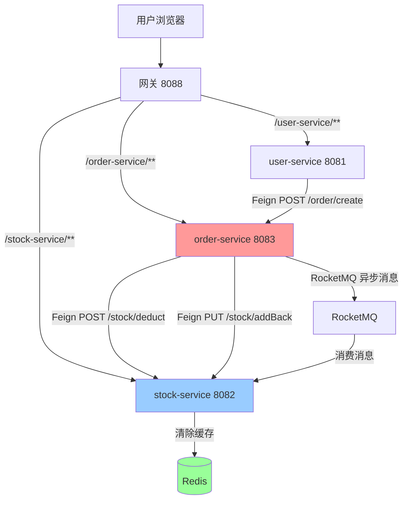

# 微服务项目 - 多模块整合

> 基于 **Spring Boot 3.2.0 + Spring Cloud Alibaba 2023.0.1.2** 构建的企业级微服务快速开发平台

[](https://spring.io/projects/spring-boot)
[](https://spring.io/projects/spring-cloud)
[](https://www.oracle.com/java/)
[](LICENSE)

## 📖 项目简介

本项目是一个完整的微服务架构实践项目，整合了**用户、库存、订单**三大核心业务模块，采用前后端分离架构，通过网关统一对外提供服务。

### ✨ 核心特性

- 🎯 **服务治理**：Nacos 注册中心 + 配置中心，实现服务自动发现与动态配置管理
- 🚪 **网关路由**：Spring Cloud Gateway 统一入口，支持路由转发、全局鉴权、跨域处理
- 🛡️ **流量控制**：Sentinel 实现网关层流控 + 业务层熔断降级，保障系统稳定性
- 💾 **分布式事务**：Seata AT 模式保证订单创建与库存扣减的数据一致性
- 📨 **消息队列**：RocketMQ 异步解耦订单与库存缓存清除操作
- ⚡ **缓存加速**：Redis 缓存热点库存数据，提升查询性能
- 📝 **接口文档**：Knife4j 聚合各服务 Swagger 文档，支持在线调试
- 🔐 **安全认证**：JWT Token 鉴权，网关层统一校验，下游服务透传用户ID
- 🔄 **防重放攻击**：基于 Nonce + Timestamp 的请求防重放机制，支持网关层自动注入和业务层双重防护

### 🔄 业务链路

```
用户请求 → 网关(8088) → 用户服务(8081) → Feign调用 → 订单服务(8083) 
                                              ↓
                                         Seata分布式事务
                                              ↓
                                    Feign调用 → 库存服务(8082)
                                              ↓
                                    RocketMQ异步消息 → 清除Redis缓存
```
## 🛠️ 技术栈

| 类别 | 技术 | 版本 |
|------|------|------|
| **核心框架** | Spring Boot | 3.2.0 |
| **微服务框架** | Spring Cloud | 2023.0.1 |
| **微服务框架** | Spring Cloud Alibaba | 2023.0.1.2 |
| **网关** | Spring Cloud Gateway | 4.1.0 |
| **负载均衡** | Spring Cloud LoadBalancer | 4.1.0 |
| **ORM 框架** | MyBatis-Plus | 3.5.12 |
| **数据库** | PostgreSQL | 15+ |
| **服务治理** | Nacos | 3.2.0 |
| **接口文档** | Knife4j | 4.5.0 |
| **缓存** | Redis | 5.0.14.1 |
| **流量控制** | Sentinel | 1.8.8 |
| **分布式事务** | Seata | 2.0.0 |
| **消息队列** | RocketMQ | 5.3.1 |
| **对象映射** | MapStruct | 1.5.5.Final |
| **JSON 处理** | Jackson | 2.15.3 |
| **参数校验** | Jakarta Validation | 3.0.2 |
| **注解增强** | Lombok | 1.18.32 |
| **接口注解** | Swagger Annotations | 2.2.21 |
| **JWT** | JJWT | 0.12.3 |
| **AOP 编程** | Spring AOP | 6.1.2 |

## 📁 项目结构

```
micro-service-project/
├── common-core/              # 公共核心模块（统一返回、异常处理、工具类、防重放注解）
│   └── src/main/java/com/spring/boot/commoncore/
│       ├── annotation/       # 注解定义（PreventReplay 防重放注解）
│       ├── constant/         # 常量定义（FeignHeaders等）
│       ├── exception/        # 业务异常类
│       ├── result/           # 统一响应体Result、结果码ResultCode
│       ├── util/             # 工具类（ExceptionUtil异常解包）
│       └── vo/               # 通用VO（PageVO分页工具）
│
├── common-web/               # 公共 Web 模块（全局异常拦截、序列化、分页配置、防重放切面）
│   └── src/main/java/com/spring/boot/commonweb/
│       ├── aspect/           # AOP切面（ReplayAttackAspect 防重放攻击切面）
│       ├── component/        # 组件（IdGenerator ID生成器）
│       ├── config/           # 配置类（Jackson、MyBatis-Plus、IdGenerator）
│       ├── exception/        # 全局异常处理器GlobalExceptionHandler
│       ├── interceptor/      # 拦截器（FeignReplayInterceptor Feign防重放拦截器）
│       └── util/             # 工具类（ReplayAttackPreventor 防重放验证器）
│
├── gateway/                  # 网关模块（路由转发、鉴权、限流、文档聚合、防重放过滤）
│   └── src/main/java/com/spring/boot/gateway/
│       ├── config/           # 配置类（AuthGlobalFilter鉴权、SentinelConfig限流、GlobalErrorWebExceptionHandler异常处理、ReplayAttackFilter防重放过滤）
│       └── util/             # 工具类（JwtUtil JWT解析）
│
├── user-service/             # 用户服务（端口：8081）
│   └── src/main/java/com/spring/boot/userservice/
│       ├── config/           # 配置类
│       ├── controller/       # 控制器（用户CRUD、下单接口）
│       ├── convert/          # 对象转换器（MapStruct）
│       ├── dto/              # 数据传输对象
│       ├── entity/           # 实体类
│       ├── feign/            # Feign客户端（调用订单服务）
│       ├── mapper/           # MyBatis Mapper
│       ├── service/          # 业务逻辑层
│       ├── util/             # 工具类
│       └── vo/               # 视图对象
│
├── stock-service/            # 库存服务（端口：8082）
│   └── src/main/java/com/spring/boot/stockservice/
│       ├── config/           # 配置类
│       ├── controller/       # 控制器（库存CRUD、扣减、回滚）
│       ├── convert/          # 对象转换器（MapStruct）
│       ├── dto/              # 数据传输对象
│       ├── entity/           # 实体类
│       ├── mapper/           # MyBatis Mapper
│       ├── mq/               # 消息队列消费者（OrderMessageConsumer）
│       ├── service/          # 业务逻辑层（StockService DB实现 + StockServiceCacheImpl 缓存实现）
│       └── vo/               # 视图对象
│
├── order-service/            # 订单服务（端口：8083）
│   └── src/main/java/com/spring/boot/orderservice/
│       ├── common/           # 公共类（订单状态枚举等）
│       ├── config/           # 配置类
│       ├── controller/       # 控制器（订单CRUD、创建、取消）
│       ├── convert/          # 对象转换器（MapStruct）
│       ├── dto/              # 数据传输对象
│       ├── entity/           # 实体类
│       ├── feign/            # Feign客户端（调用库存服务、用户服务）
│       ├── mapper/           # MyBatis Mapper
│       ├── mq/               # 消息队列生产者（OrderMessageProducer）
│       ├── service/          # 业务逻辑层
│       └── vo/               # 视图对象（含feign子包）
│
├── pom.xml                   # 父工程 POM（统一依赖管理）
└── README.md                 # 项目说明文档
```
> **分层说明**：各业务模块采用统一分层架构 `config` / `controller` / `convert` / `dto` / `entity` / `mapper` / `service.impl` / `vo`
>
> **差异说明**：
> - `user-service`、`order-service` 含 `feign` 包（远程调用其他服务）
> - `stock-service` 的 `service` 采用 DB + Cache 双实现策略
> - `order-service` 含 `common` 包（订单状态枚举等公共类）
> - `stock-service`、`order-service` 含 `mq` 包（消息队列相关）

## 📦 模块说明

| 模块 | 说明 | 端口 | 核心技术 |
|------|------|------|---------|
| `common-core` | 公共核心模块：<br/>• Result 统一响应体<br/>• ResultCode 业务码枚举<br/>• BusinessException 业务异常<br/>• PageVO 分页工具<br/>• ExceptionUtil 异常解包<br/>• PreventReplay 防重放注解 | - | - |
| `common-web` | 公共 Web 模块：<br/>• GlobalExceptionHandler 全局异常拦截<br/>• JacksonConfig JSON 序列化配置<br/>• MyBatisPlusConfig 分页插件<br/>• IdGenerator 分布式ID生成器<br/>• ReplayAttackAspect 防重放AOP切面<br/>• FeignReplayInterceptor Feign防重放拦截器<br/>• ReplayAttackPreventor 防重放验证器 | - | MyBatis-Plus、Sentinel、Spring AOP |
| `gateway` | 网关模块：<br/>• 路由转发（StripPrefix=1）<br/>• 全局鉴权（AuthGlobalFilter）<br/>• 全局异常处理（GlobalErrorWebExceptionHandler）<br/>• Sentinel 网关流控（SentinelConfig）<br/>• 跨域配置（Global CORS）<br/>• Knife4j 文档聚合<br/>• ReplayAttackFilter 防重放过滤器（自动注入 Nonce + Timestamp） | 8088 | Spring Cloud Gateway、Sentinel、JWT、Knife4j |
| `user-service` | 用户服务：<br/>• 用户 CRUD、分页查询<br/>• Feign 调用订单模块下单<br/>• Sentinel 熔断降级<br/>• 登录注册（白名单） | 8081 | OpenFeign、Sentinel、PostgreSQL |
| `stock-service` | 库存服务：<br/>• 库存 CRUD、分页查询<br/>• 扣减库存、回滚库存<br/>• Redis 缓存热点数据<br/>• RocketMQ 消费订单消息清除缓存<br/>• Sentinel 熔断降级<br/>• Seata 分布式事务参与者 | 8082 | Redis、RocketMQ、Seata、Sentinel、PostgreSQL |
| `order-service` | 订单服务：<br/>• 创建订单（生成订单号、扣减库存）<br/>• 取消订单（回滚库存）<br/>• 订单 CRUD、分页查询<br/>• Seata 分布式事务发起者<br/>• RocketMQ 发送订单消息<br/>• Sentinel 熔断降级 | 8083 | Seata、RocketMQ、OpenFeign、Sentinel、PostgreSQL |

## 🚀 快速开始

### 1️⃣ 环境要求

- **JDK**：17+（推荐 Oracle JDK 17 或 OpenJDK 17）
- **Maven**：3.6+（推荐 3.8.x 或 3.9.x）
- **数据库**：PostgreSQL 15+
- **中间件**：
  - Nacos 3.2.0（注册中心 + 配置中心）
  - Redis 5.0.14.1+（缓存）
  - Seata 2.0.0（分布式事务）
  - RocketMQ 5.3.1+（消息队列，可选）
  - Sentinel Dashboard 1.8.8+（流量监控，可选）

### 2️⃣ 克隆项目

```bash
git clone https://gitee.com/city_xing/micro_service_project.git
cd micro-service-project
```
### 3️⃣ 配置环境

各服务配置文件按环境拆分（`application.yml` / `application-dev.yml` / `application-test.yml` / `application-prod.yml` / `bootstrap.yml`），修改对应环境的配置即可。

#### 关键配置项

| 配置项 | 位置 | 说明 |
|--------|------|------|
| **数据库** | 各业务服务 `application-*.yml` | PostgreSQL 连接地址、用户名、密码 |
| **Nacos** | 各服务 `bootstrap.yml` | 注册中心与配置中心地址 |
| **Redis** | `stock-service/application-*.yml` | 连接地址与端口 |
| **Seata** | `order-service`、`stock-service/application-*.yml` | 事务组 `my_micro_service_group` 与 TC Server 地址 |
| **RocketMQ** | `order-service`、`stock-service/application-*.yml` | NameServer 地址 |
| **Sentinel** | 各服务 `application-*.yml` | Dashboard 地址、规则数据源（Nacos） |
| **日志级别** | 各服务 `application-*.yml` | dev: debug / test: info / prod: warn + 文件滚动存储 |

#### 环境变量（可选）

支持通过环境变量覆盖默认配置：

```bash
# 数据库密码
export DB_PASSWORD=your_password

# Nacos 地址
export NACOS_ADDR=127.0.0.1:8848

# Redis 地址
export REDIS_HOST=localhost
export REDIS_PORT=6379

# Seata 地址
export SEATA_ADDR=127.0.0.1:8091

# RocketMQ 地址
export ROCKETMQ_ADDR=localhost:9876

# Sentinel Dashboard 地址
export SENTINEL_DASHBOARD=127.0.0.1:8089
```
### 4️⃣ 初始化数据库

在 PostgreSQL 中创建数据库：

```sql
CREATE DATABASE micro_service_project;
```
执行建表脚本（需自行准备 SQL 脚本，包含用户表、订单表、库存表及 Seata  undo_log 表）。

### 5️⃣ 编译项目

```bash
mvn clean install -DskipTests
```
### 6️⃣ 启动中间件

**按顺序启动以下中间件**，确保各服务能正常注册与通信：

| 中间件 | 版本 | 启动方式 | 访问地址 | 默认账号/密码 |
|--------|------|---------|---------|--------------|
| **Nacos** | 3.2.0 | `startup.cmd -m standalone`（Windows）<br/>`sh startup.sh -m standalone`（Linux/Mac） | `http://localhost:8848/nacos` | nacos / nacos |
| **Redis** | 5.0.14.1+ | Windows: 双击 `redis-server.exe`<br/>Linux/Mac: `redis-server` | - | - |
| **Seata** | 2.0.0 | `seata-server.bat`（Windows）<br/>`sh seata-server.sh`（Linux/Mac） | - | - |
| **RocketMQ** | 5.3.1+ | 参考 [RocketMQ 官方文档](https://rocketmq.apache.org/docs/quick-start/) | - | - |
| **Sentinel Dashboard** | 1.8.8+ | `java -jar sentinel-dashboard-1.8.8.jar` | `http://localhost:8089` | sentinel / sentinel |

> 💡 **提示**：RocketMQ 和 Sentinel Dashboard 为可选组件，不影响基础功能运行。

### 7️⃣ 启动服务

**按依赖顺序启动**：中间件 → 业务服务 → 网关

```bash
# 终端1：启动用户服务
mvn spring-boot:run -pl user-service

# 终端2：启动库存服务
mvn spring-boot:run -pl stock-service

# 终端3：启动订单服务
mvn spring-boot:run -pl order-service

# 终端4：启动网关（最后启动，等待子服务注册完成）
mvn spring-boot:run -pl gateway
```
> ⚠️ **注意**：网关必须最后启动，确保所有子服务已成功注册到 Nacos。

### 8️⃣ 验证服务

启动完成后，可通过以下方式验证：

1. **查看 Nacos 控制台**：`http://localhost:8848/nacos` → 服务管理 → 服务列表，确认 4 个服务均已注册
2. **访问接口文档**：`http://localhost:8088/doc.html`
3. **查看 Sentinel 控制台**（如已启动）：`http://localhost:8089`

## 🌐 网关路由规则

| 路由前缀 | 目标服务 | 说明 |
|---------|---------|------|
| `/user-service/**` | user-service (8081) | 用户服务，StripPrefix=1 |
| `/order-service/**` | order-service (8083) | 订单服务，StripPrefix=1 |
| `/stock-service/**` | stock-service (8082) | 库存服务，StripPrefix=1 |

### 🔓 白名单路径（无需鉴权）

- **登录注册**：`/user-service/user/login`、`/user-service/user/register`
- **接口文档**：`/doc.html`、`/webjars/**`、`/**/v3/api-docs/**`、`/**/swagger-resources/**`、`/**/swagger-ui/**`、`/**/swagger-ui.html`、`/favicon.ico`

### 🔐 鉴权机制

- **Token 传递**：客户端在请求头 `Authorization` 中携带 JWT Token
- **Token 验证**：网关层统一校验 Token 有效性
- **用户信息透传**：验证通过后，网关将用户ID写入请求头 `X-UserId`，下游服务直接读取
- **鉴权失败响应**：HTTP 401 + 统一 JSON 响应体
  - `GATEWAY_TOKEN_MISSING`：缺少 Token
  - `GATEWAY_TOKEN_EXPIRED`：Token 无效或过期

### 🔄 防重放攻击机制

项目实现了双层防重放攻击保护机制：

#### 1. 网关层自动注入

网关通过 `ReplayAttackFilter` 为所有请求自动注入防重放参数：

- **X-Nonce**：唯一请求标识（UUID）
- **X-Timestamp**：请求时间戳（毫秒）

这两个参数会自动传递给下游所有微服务，用于业务层的防重放验证。

#### 2. 业务层防重放验证

业务服务可通过 `@PreventReplay` 注解启用防重放保护：

```java
@PreventReplay(timeout = 60000) // 默认超时60秒
@PostMapping("/order/create")
public Result<OrderVO> createOrder(@RequestBody @Valid OrderCreateDTO dto) {
	// 业务逻辑
}
```

**工作原理**：
- `ReplayAttackAspect` 切面拦截标注了 `@PreventReplay` 的方法
- 从请求头提取 `X-Nonce` 和 `X-Timestamp`
- 验证时间戳是否在有效期内（默认60秒）
- 检查 Nonce 是否已被使用（防止重复请求）
- Feign 调用时通过 `FeignReplayInterceptor` 自动传递防重放参数

**适用场景**：
- 订单创建、支付等幂等性要求高的接口
- 资金相关的敏感操作
- 需要防止恶意重放攻击的关键业务接口

## 🔗 服务间调用关系


### 调用链路详解

1. **用户下单流程**：
   ```
   前端 → 网关 → user-service.order() → Feign → order-service.createOrder()
                                          ↓
                                    Seata 全局事务
                                          ↓
                                   Feign → stock-service.deductStock()
                                          ↓
                                   RocketMQ 发送订单创建消息
   ```
2. **用户取消订单流程**：
   ```
   前端 → 网关 → order-service.cancelOrder()
                                          ↓
                                    Seata 全局事务
                                          ↓
                                   Feign → stock-service.addBackStock()
                                          ↓
                                   RocketMQ 发送订单取消消息
   ```
3. **库存缓存清除流程**：
   ```
   RocketMQ 消息 → stock-service.OrderMessageConsumer → 清除 Redis 缓存
   ```
## 🛡️ 流量控制与熔断降级

### 网关层流控

网关集成 Sentinel，支持从 Nacos 动态加载流控规则：

- **Data ID**：`gateway-gw-flow-rules`
- **Group**：`SENTINEL_GROUP`
- **规则类型**：
  - QPS 限流 / 热点参数限流 → 抛出 `ParamFlowException`
  - 授权规则 → 抛出 `AuthorityException`
- **限流响应**：HTTP 429 + 统一 JSON 格式（`GATEWAY_RATE_LIMIT`）

#### 配置示例（Nacos 配置）

```json
[
  {
    "resource": "user-service",
    "count": 100,
    "grade": 1,
    "limitApp": "default"
  }
]
```
### 业务层熔断降级

各子服务通过 `@SentinelResource` 接入熔断降级：

| 服务 | 资源名 | fallback | blockHandler | 说明 |
|------|--------|----------|-------------|------|
| user-service | `userCreateOrder` | `UserBlockHandler.handleFallback` | `UserBlockHandler.handleBlock` | 用户下单接口 |
| order-service | `createOrder` | `OrderBlockHandler.handleCreateOrderFallback` | `OrderBlockHandler.handleCreateOrderBlock` | 创建订单接口 |
| order-service | `cancelOrder` | `OrderBlockHandler.handleCancelOrderFallback` | `OrderBlockHandler.handleCancelOrderBlock` | 取消订单接口 |
| stock-service | `deductStock` | `StockBlockHandler.handleFallback` | `StockBlockHandler.handleBlock` | 扣减库存接口 |

#### 降级策略

- **业务异常**（`BusinessException`）：通过 `ExceptionUtil.unwind()` 解包后透传原错误码
- **系统异常**：返回对应模块的 `DEGRADE` 业务码（如 `USER_SERVICE_DEGRADE`）
- **限流/熔断**：返回对应模块的 `FLOWING` 业务码（如 `USER_SERVICE_RATE_LIMIT`）

#### 降级规则配置（Nacos 配置示例）

```json
[
  {
    "resource": "createOrder",
    "grade": 2,
    "count": 0.5,
    "timeWindow": 10,
    "minRequestAmount": 5,
    "statIntervalMs": 1000
  }
]
```
## 📊 监控与运维

### Sentinel 监控

- **Dashboard 地址**：`http://localhost:8089`
- **监控内容**：QPS、响应时间、异常数、线程数、限流次数等
- **规则管理**：可在 Dashboard 实时修改流控规则、降级规则（重启后失效，建议持久化到 Nacos）

### 日志管理

- **开发环境**（dev）：日志级别 `DEBUG`，输出到控制台
- **测试环境**（test）：日志级别 `INFO`，输出到控制台
- **生产环境**（prod）：日志级别 `WARN`，输出到控制台 + 文件滚动存储

### 健康检查

- **网关健康检查**：`http://localhost:8088/actuator/health`
- **业务服务健康检查**：`http://localhost:{port}/actuator/health`

## 📝 API 文档

启动完成后，通过网关统一入口访问接口文档：

```
http://localhost:8088/doc.html
```
Knife4j 自动聚合所有微服务的 Swagger 文档，支持：
- 📖 在线浏览接口文档
- 🧪 接口在线调试
- 📥 导出 Markdown/HTML 文档
- 🔄 实时更新（服务重启后自动刷新）

## ✅ 待办事项

- [x] 完善网关路由规则说明
- [x] 完善服务间调用关系说明
- [x] 接入 Sentinel 流量控制与熔断降级
- [x] 接入 RocketMQ 异步消息（订单与库存缓存解耦）
- [x] 实现防重放攻击保护机制（网关层 + 业务层双重防护）
- [ ] 补充部署说明（Docker / Docker Compose）
- [ ] 补充单元测试与集成测试
- [ ] 补充 CI/CD 流水线配置
- [ ] 补充性能测试报告
- [ ] 补充常见问题 FAQ

## 📄 License

MIT License

Copyright (c) 2026 Chi Shoucheng

Permission is hereby granted, free of charge, to any person obtaining a copy
of this software and associated documentation files (the "Software"), to deal
in the Software without restriction...

---

## 👥 作者信息

- **作者**：Chi Shoucheng
- **邮箱**：1017191272@qq.com
- **Gitee**：[city_xing](https://gitee.com/city_xing)

## 🙏 致谢

感谢以下开源项目为本项目提供支持：

- [Spring Boot](https://spring.io/projects/spring-boot)
- [Spring Cloud](https://spring.io/projects/spring-cloud)
- [Spring Cloud Alibaba](https://github.com/alibaba/spring-cloud-alibaba)
- [MyBatis-Plus](https://baomidou.com/)
- [Knife4j](https://doc.xiaominfo.com/)
- [Sentinel](https://sentinelguard.io/)
- [Seata](https://seata.io/)
- [RocketMQ](https://rocketmq.apache.org/)

---

**⭐ 如果本项目对您有帮助，欢迎 Star 支持一下！**