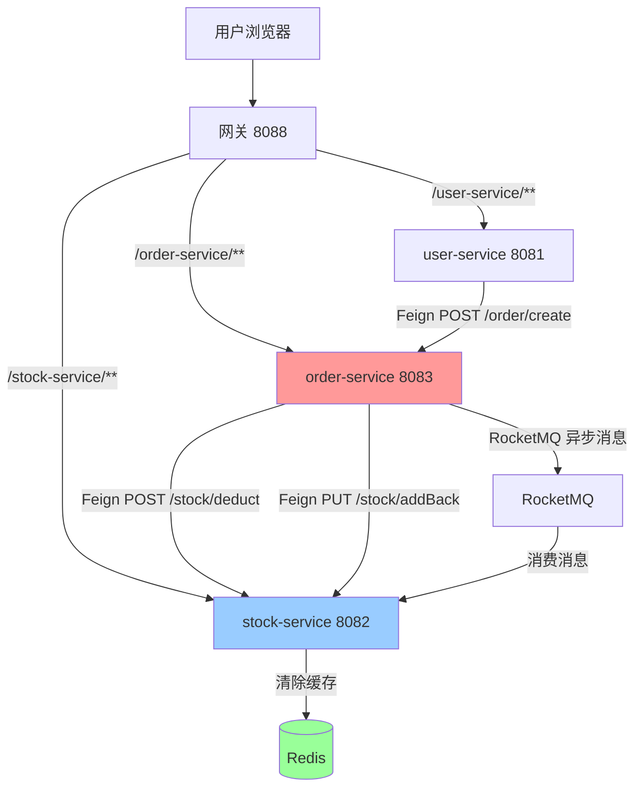

# 微服务项目 - 多模块整合

> 基于 **Spring Boot 3.2.0 + Spring Cloud Alibaba 2023.0.1.2** 构建的企业级微服务快速开发平台

[](https://spring.io/projects/spring-boot)
[](https://spring.io/projects/spring-cloud)
[](https://www.oracle.com/java/)
[](LICENSE)
[]()
[]()
[]()


## 📖 项目简介

本项目是一个完整的微服务架构实践项目，整合了**用户、库存、订单**三大核心业务模块，采用前后端分离架构，通过网关统一对外提供服务。

### ✨ 核心特性

- 🎯 **服务治理**：Nacos 注册中心 + 配置中心，实现服务自动发现与动态配置管理
- 🚪 **网关路由**：Spring Cloud Gateway 统一入口，支持路由转发、全局鉴权、跨域处理
- 🛡️ **流量控制**：Sentinel 实现网关层流控 + 业务层熔断降级，保障系统稳定性
- 💾 **分布式事务**：Seata AT 模式保证订单创建与库存扣减的数据一致性
- 📨 **消息队列**：RocketMQ 异步解耦订单与库存缓存清除操作
- ⚡ **缓存加速**：Redis 缓存热点库存数据，提升查询性能
- 📝 **接口文档**：Knife4j 聚合各服务 Swagger 文档，支持在线调试
- 🔐 **安全认证**：JWT 双 Token（Access + Refresh）鉴权，网关层统一校验，下游服务透传用户ID
- 🔄 **防重放攻击**：基于 Nonce + Timestamp 的请求防重放机制，支持网关层自动注入和业务层双重防护
- 🚫 **Token 黑名单**：基于 Redis 的 Token 黑名单机制，支持即时登出与安全注销

### 🔄 业务链路

```
用户请求 → 网关(8088) → 用户服务(8081) → Feign → 订单服务(8083)
                                                    ↓
                                            Seata 分布式事务
                                                    ↓
                                          Feign → 库存服务(8082)
                                                    ↓
                                     RocketMQ 异步消息 → 清除 Redis 缓存
```

## 🛠️ 技术栈

| 类别          | 技术                        | 版本          |
|-------------|---------------------------|-------------|
| **核心框架**    | Spring Boot               | 3.2.0       |
| **微服务框架**   | Spring Cloud              | 2023.0.1    |
| **微服务框架**   | Spring Cloud Alibaba      | 2023.0.1.2  |
| **网关**      | Spring Cloud Gateway      | 4.1.0       |
| **负载均衡**    | Spring Cloud LoadBalancer | 4.1.0       |
| **ORM 框架**  | MyBatis-Plus              | 3.5.12      |
| **数据库**     | PostgreSQL                | 15+         |
| **服务治理**    | Nacos                     | 3.2.0       |
| **接口文档**    | Knife4j                   | 4.5.0       |
| **缓存**      | Redis                     | 7-alpine    |
| **流量控制**    | Sentinel                  | 1.8.8       |
| **分布式事务**   | Seata                     | 2.0.0       |
| **消息队列**    | RocketMQ                  | 5.3.1       |
| **对象映射**    | MapStruct                 | 1.5.5.Final |
| **JSON 处理** | Jackson                   | 2.15.3      |
| **参数校验**    | Jakarta Validation        | 3.0.2       |
| **注解增强**    | Lombok                    | 1.18.32     |
| **接口注解**    | Swagger Annotations       | 2.2.21      |
| **JWT**     | JJWT                      | 0.12.3      |
| **AOP 编程**  | Spring AOP                | 6.1.2       |
| **密码加密**    | Spring Security Crypto    | 6.1.2       |

> ⚠️ **Nacos 版本说明**：
> 项目使用 Nacos v2.4.0（镜像 285MB，启动约 10 秒）。
> Nacos 3.x（镜像 1.29GB，启动约 5-10 分钟，安全配置复杂）目前不适合 CI/CD 快速部署，
> 本地开发使用 3.x 不影响项目运行。CI/CD 和 Docker Compose 部署默认使用 v2.4.0。

## 📑 目录

- [项目简介](#-项目简介)
- [技术栈](#-技术栈)
- [快速开始](#-快速开始)
- [项目结构与模块说明](#-项目结构与模块说明)
- [网关路由规则](#-网关路由规则)
- [安全机制详解](#-安全机制详解)
- [服务间调用关系](#-服务间调用关系)
- [流量控制与熔断降级](#-流量控制与熔断降级)
- [监控与运维](#-监控与运维)
- [测试策略](#-测试策略)
- [API文档](#-api-文档)
- [错误码规范](#-错误码规范)
- [常见问题](#-常见问题)
- [待办事项](#-待办事项)

## 🚀 快速开始

### 1️⃣ 环境要求

- **JDK**：17+（推荐 Oracle JDK 17 或 OpenJDK 17）
- **Maven**：3.6+（推荐 3.8.x 或 3.9.x）
- **数据库**：PostgreSQL 15+
- **中间件**：
  - Nacos 3.2.0（注册中心 + 配置中心）
  - Redis 5.0.14.1+（缓存）
  - Seata 2.0.0（分布式事务）
  - RocketMQ 5.3.1+（消息队列，可选）
  - Sentinel Dashboard 1.8.8+（流量监控，可选）

> ⚠️ **版本兼容性说明**：
> - Spring Boot 3.x 需要 JDK 17+，不支持 JDK 8/11
> - Spring Cloud 2023.x 对应 Spring Boot 3.2.x，两者版本强绑定
> - Seata 2.0.0 才支持 Spring Boot 3.x，1.x 版本不兼容
> - Nacos 客户端 3.2.0 需要 Nacos Server 2.3.0+

### 2️⃣ 克隆项目

```bash
git clone https://github.com/Cheng-0129/micro-service-project.git
cd micro-service-project
```

### 3️⃣ 配置环境

各服务配置文件按环境拆分（`application.yml` / `application-dev.yml` / `application-test.yml` / `application-prod.yml` / `bootstrap.yml`），修改对应环境的配置即可。

#### 关键配置项

| 配置项          | 位置                                                | 说明                                            |
|--------------|---------------------------------------------------|-----------------------------------------------|
| **数据库**      | 各业务服务 `application-*.yml`                         | PostgreSQL 连接地址、用户名、密码                        |
| **Nacos**    | 各服务 `bootstrap.yml`                               | 注册中心与配置中心地址                                   |
| **Redis**    | `stock-service/application-*.yml`                 | 连接地址与端口                                       |
| **Seata**    | `order-service`、`stock-service/application-*.yml` | 事务组 `my_micro_service_group` 与 TC Server 地址   |
| **RocketMQ** | `order-service`、`stock-service/application-*.yml` | NameServer 地址                                 |
| **Sentinel** | 各服务 `application-*.yml`                           | Dashboard 地址、规则数据源（Nacos）                     |
| **日志级别**     | 各服务 `application-*.yml`                           | dev: debug / test: info / prod: warn + 文件滚动存储 |

#### 环境变量（可选）

项目提供了 `.env.example` 模板文件，复制为 `.env` 后可统一管理环境变量：

```bash
cp .env.example .env
```

支持通过环境变量覆盖默认配置：

```bash
# 数据库密码
export DB_PASSWORD=your_password

# Nacos 地址
export NACOS_ADDR=127.0.0.1:8848

# Redis 地址
export REDIS_HOST=localhost
export REDIS_PORT=6379

# Seata 地址
export SEATA_ADDR=127.0.0.1:8091

# RocketMQ 地址
export ROCKETMQ_ADDR=localhost:9876

# Sentinel Dashboard 地址
export SENTINEL_DASHBOARD=127.0.0.1:8089
```

### 4️⃣ 初始化数据库

```bash
# 创建数据库（如已创建可跳过）
psql -U your_username -c "CREATE DATABASE micro_service_project;"

# 导入建表脚本
psql -U your_username -d micro_service_project -f sql/init.sql
```

### 5️⃣ 编译项目

```bash
mvn clean install -DskipTests
```

### 6️⃣ 启动中间件

**按顺序启动以下中间件**，确保各服务能正常注册与通信：

| 中间件                    | 版本        | 启动方式                                                                              | 访问地址                          | 默认账号/密码             |
|------------------------|-----------|-----------------------------------------------------------------------------------|-------------------------------|---------------------|
| **Nacos**              | 3.2.0     | `startup.cmd -m standalone`（Windows）<br/>`sh startup.sh -m standalone`（Linux/Mac） | `http://localhost:8848/nacos` | nacos / nacos       |
| **Redis**              | 5.0.14.1+ | Windows: 双击 `redis-server.exe`<br/>Linux/Mac: `redis-server`                      | -                             | -                   |
| **Seata**              | 2.0.0     | `seata-server.bat`（Windows）<br/>`sh seata-server.sh`（Linux/Mac）                   | -                             | -                   |
| **RocketMQ**           | 5.3.1+    | 参考 [RocketMQ 官方文档](https://rocketmq.apache.org/docs/quick-start/)                 | -                             | -                   |
| **Sentinel Dashboard** | 1.8.8+    | `java -jar sentinel-dashboard-1.8.8.jar`                                          | `http://localhost:8089`       | sentinel / sentinel |

> 💡 **提示**：RocketMQ 和 Sentinel Dashboard 为可选组件，不影响基础功能运行。

### 7️⃣ 启动服务

**按依赖顺序启动**：中间件 → 业务服务 → 网关

```bash
# 终端1：启动用户服务
mvn spring-boot:run -pl user-service

# 终端2：启动库存服务
mvn spring-boot:run -pl stock-service

# 终端3：启动订单服务
mvn spring-boot:run -pl order-service

# 终端4：启动网关（最后启动，等待子服务注册完成）
mvn spring-boot:run -pl gateway
```

> ⚠️ **注意**：网关必须最后启动，确保所有子服务已成功注册到 Nacos。

### 8️⃣ 验证服务

启动完成后，可通过以下方式验证：

1. **查看 Nacos 控制台**：`http://localhost:8848/nacos` → 服务管理 → 服务列表，确认 4 个服务均已注册
2. **访问接口文档**：`http://localhost:8088/doc.html`
3. **查看 Sentinel 控制台**（如已启动）：`http://localhost:8089`
4. **测试登录注册接口**：

```bash
# 注册用户
curl -X POST http://localhost:8088/user-service/user/register \
  -H "Content-Type: application/json" \
  -d '{"name":"test","password":"123456","age":20,"email":"test@example.com"}'

# 用户登录（会返回 accessToken 和 refreshToken）
curl -X POST http://localhost:8088/user-service/user/login \
  -H "Content-Type: application/json" \
  -d '{"username":"test","password":"123456"}'
```

5. **完整业务流程测试**：

```bash
# ① 登录获取 Token
RESPONSE=$(curl -s -X POST http://localhost:8088/user-service/user/login \
  -H "Content-Type: application/json" \
  -d '{"username":"test","password":"123456"}')
ACCESS_TOKEN=$(echo $RESPONSE | jq -r '.data.accessToken')
REFRESH_TOKEN=$(echo $RESPONSE | jq -r '.data.refreshToken')

# ② 使用 Token 访问受保护接口（查询用户信息）
curl -X GET http://localhost:8088/user-service/user/1 \
  -H "Authorization: Bearer $ACCESS_TOKEN"

# ③ 刷新 Token
curl -X POST http://localhost:8088/user-service/user/refresh \
  -H "Authorization: Bearer $REFRESH_TOKEN"

# ④ 登出（将 Token 加入黑名单）
curl -X POST http://localhost:8088/user-service/user/logout \
  -H "Authorization: Bearer $ACCESS_TOKEN" \
  -H "X-Refresh-Token: $REFRESH_TOKEN"
```

> 💡 **提示**：以上命令需要安装 `jq` 工具用于解析 JSON。Windows 用户可使用 Git Bash 或 WSL 执行。

## 📁 项目结构与模块说明

```
micro-service-project/
│
├── common-core/              # 公共核心模块
│   │  • Result 统一响应体、ResultCode 业务码枚举
│   │  • BusinessException 业务异常、ExceptionUtil 异常解包
│   │  • PageVO 分页工具、PreventReplay 防重放注解
│   │  • FeignHeaders 常量定义
│   └── 无独立启动，被其他模块依赖
│
├── common-web/               # 公共 Web 模块
│   │  • GlobalExceptionHandler 全局异常拦截
│   │  • JacksonConfig JSON 序列化配置、MyBatisPlusConfig 分页插件
│   │  • IdGenerator 分布式ID生成器（雪花算法）
│   │  • ReplayAttackAspect 防重放 AOP 切面
│   │  • FeignReplayInterceptor Feign 防重放拦截器
│   │  • ReplayAttackPreventor 防重放验证器（Redis 实现）
│   └── 核心技术：MyBatis-Plus、Spring AOP、Redis（防重放验证器）
│
├── gateway/                  # 网关模块 【端口：8088】
│   │  • 路由转发（StripPrefix=1）统一入口
│   │  • AuthGlobalFilter 全局鉴权（JWT 双 Token + 黑名单校验）
│   │  • GlobalErrorWebExceptionHandler 全局异常处理（统一 JSON 响应）
│   │  • SentinelConfig 网关流控（QPS限流/热点参数限流/授权规则）
│   │  • ReplayAttackFilter 防重放过滤器（自动注入 X-Nonce + X-Timestamp）
│   │  • 全局跨域配置、Knife4j 文档聚合
│   └── 核心技术：Spring Cloud Gateway、Sentinel、JWT、Knife4j
│
├── user-service/             # 用户服务 【端口：8081】
│   │  • 用户 CRUD、分页查询
│   │  • JWT 双 Token 认证（Access 15分钟 + Refresh 7天）
│   │  • Token 黑名单管理（Redis）、密码加密（BCrypt）
│   │  • 登录/注册（白名单路径，无需鉴权）
│   │  • Feign 调用订单服务下单（userCreateOrder）
│   │  • Sentinel 熔断降级（UserBlockHandler）
│   └── 核心技术：OpenFeign、Sentinel、JWT、Redis、PostgreSQL、Spring Security Crypto
│
├── stock-service/            # 库存服务 【端口：8082】
│   │  • 库存 CRUD、分页查询
│   │  • 扣减库存（deductStock）、回滚库存（addBackStock）
│   │  • Redis 缓存热点数据（DB + Cache 双实现策略）
│   │  • RocketMQ 消费订单消息（OrderMessageConsumer）清除缓存
│   │  • Sentinel 熔断降级（StockBlockHandler）
│   │  • Seata 分布式事务参与者（RM）
│   └── 核心技术：Redis、RocketMQ、Seata、Sentinel、PostgreSQL
│
├── order-service/            # 订单服务 【端口：8083】
│   │  • 创建订单（生成订单号 + 扣减库存）、取消订单（回滚库存）
│   │  • 订单 CRUD、分页查询
│   │  • Seata 分布式事务发起者（TM，@GlobalTransactional）
│   │  • RocketMQ 发送订单消息（OrderMessageProducer）异步解耦
│   │  • Sentinel 熔断降级（OrderBlockHandler）
│   │  • 防重放保护（@PreventReplay 注解）
│   │  • Feign 调用库存服务、用户服务
│   │  • 订单状态枚举（PENDING/PAID/CANCELLED 等）
│   └── 核心技术：Seata、RocketMQ、OpenFeign、Sentinel、PostgreSQL
│
├── pom.xml                   # 父工程 POM（统一依赖管理）
└── README.md                 # 项目说明文档
```

### 📐 统一分层架构
各业务模块（user-service、stock-service、order-service）采用统一分层：

```
{service}/src/main/java/com/spring/boot/{service}/
    ├── config/           # 配置类（Jackson、MyBatis-Plus、线程池等）
    ├── controller/       # 控制器层（接口定义、参数校验）
    ├── convert/          # 对象转换器（MapStruct Entity ↔ DTO ↔ VO）
    ├── dto/              # 数据传输对象（接收前端参数）
    ├── entity/           # 数据库实体类
    ├── mapper/           # MyBatis-Plus Mapper 接口
    ├── service/          # 业务逻辑层（接口 + impl 实现）
    └── vo/               # 视图对象（返回前端数据）
```

> 💡 **示例**：user-service/src/main/java/com/spring/boot/userservice/

### 🔀 模块差异说明
| 差异点        | user-service       | stock-service               | order-service                   |
|------------|--------------------|-----------------------------|---------------------------------|
| Feign 远程调用 | ✅ 调用 order-service | ❌                           | ✅ 调用 stock-service、user-service |
| 消息队列       | ❌                  | ✅ 消费者（OrderMessageConsumer） | ✅ 生产者（OrderMessageProducer）     |
| 分布式事务      | ❌                  | ✅ Seata RM（参与者）             | ✅ Seata TM（发起者）                 |
| 缓存策略       | ❌                  | ✅ Redis（DB + Cache 双实现）     | ❌                               |
| 公共枚举类      | ❌                  | ❌                           | ✅ common 包（订单状态等）               |
| JWT 认证     | ✅ Token 生成/刷新/黑名单  | ❌                           | ❌                               |
| 防重放保护      | ❌                  | ❌                           | ✅ @PreventReplay 注解             |

## 🌐 网关路由规则

| 路由前缀                | 目标服务                 | 说明                 |
|---------------------|----------------------|--------------------|
| `/user-service/**`  | user-service (8081)  | 用户服务，StripPrefix=1 |
| `/order-service/**` | order-service (8083) | 订单服务，StripPrefix=1 |
| `/stock-service/**` | stock-service (8082) | 库存服务，StripPrefix=1 |

### 🔓 白名单路径（无需鉴权）

- **认证接口**：`/user-service/user/login`、`/user-service/user/register`
- **Token 管理**：`/user-service/user/logout`、`/user-service/user/refresh`
- **接口文档**：`/doc.html`、`/webjars/**`、`/**/v3/api-docs`、`/**/v3/api-docs/**`、`/**/swagger-resources`、`/**/swagger-resources/**`、`/**/swagger-ui/**`、`/**/swagger-ui.html`、`/favicon.ico`

## 🔐 安全机制详解

### 1️⃣ JWT 鉴权机制

#### 双 Token 架构

项目采用 **Access Token + Refresh Token** 的双 Token 机制：

- **Access Token**：短期有效（默认 15 分钟），用于业务接口鉴权
- **Refresh Token**：长期有效（默认 7 天），用于刷新 Access Token

#### Token 结构

```json
{
  "sub": "2847610395",
  "type": "access",
  "iat": 1777670400,
  "exp": 1777671300
}
```

#### Token 传递与验证

- **Token 传递**：客户端在请求头 `Authorization` 中携带 JWT Token（格式：`Bearer <token>`）
- **Token 验证**：网关层统一校验 Token 有效性及黑名单状态
- **用户信息透传**：验证通过后，网关将用户ID写入请求头 `X-UserId`，下游服务直接读取
- **鉴权失败响应**：HTTP 401 + 统一 JSON 响应体
  - `GATEWAY_TOKEN_MISSING`：缺少 Token
  - `GATEWAY_TOKEN_EXPIRED`：Token 无效或过期
  - `GATEWAY_TOKEN_BLACKLISTED`：Token 已在黑名单中

#### Token 生命周期管理

1. **登录**：生成 Access Token（15分钟）+ Refresh Token（7天）
2. **业务请求**：携带 Access Token 访问受保护接口
3. **Token 刷新**：Access Token 过期前，使用 Refresh Token 获取新的双 Token
4. **登出**：将当前 Access Token 加入黑名单
5. **注销所有设备**：将该用户的所有 Token 加入黑名单

### 2️⃣ Token 黑名单机制

- **实现方式**：基于 Redis 存储已失效的 Token
- **Key 格式**：`blacklist:<token>`
- **过期时间**：自动与 Token 剩余有效期同步
- **应用场景**：
  - 用户主动登出：将 Access Token 加入黑名单
  - 注销所有设备：将所有活跃 Token 加入黑名单
  - 刷新 Token：旧的 Refresh Token 立即失效

> 💡 **注意**：`/user-service/user/logout` 在白名单中是为了遵循 OAuth2.0 最佳实践，允许用户在 Token 即将过期时仍能正常登出。实际的 Token 有效性由网关层的黑名单机制保证。

### 3️⃣ 密码安全

- **加密算法**：BCrypt 强哈希算法
- **加盐策略**：自动生成随机盐值
- **存储方式**：仅存储加密后的密文

### 4️⃣ 防重放攻击机制

项目实现了网关层 + 业务层双层防重放保护：

#### 网关层：自动注入

网关通过 `ReplayAttackFilter` 为所有请求自动注入防重放参数，并传递给下游微服务：

- **X-Nonce**：唯一请求标识（UUID）
- **X-Timestamp**：请求时间戳（毫秒）

#### 业务层：注解验证

业务服务可通过 `@PreventReplay` 注解启用防重放保护：

```java
@PreventReplay(timeout = 60000) // 默认超时60秒
@PostMapping("/order/create")
public Result<OrderVO> createOrder(@RequestBody @Valid OrderCreateDTO dto) {
	// 业务逻辑
}
```

**工作原理**：
- `ReplayAttackAspect` 切面拦截标注了 `@PreventReplay` 的方法
- 从请求头提取 `X-Nonce` 和 `X-Timestamp`
- 验证时间戳是否在有效期内（默认60秒）
- 检查 Nonce 是否已被使用（防止重复请求）
- Feign 调用时通过 `FeignReplayInterceptor` 自动传递防重放参数

**适用场景**：
- 订单创建、支付等幂等性要求高的接口
- 资金相关的敏感操作
- 需要防止恶意重放攻击的关键业务接口

## 🔗 服务间调用关系



### 调用链路详解

1. **用户下单流程**：

   ```
   前端 → 网关 → user-service.order() → Feign → order-service.createOrder()
                                          ↓
                                    Seata 全局事务
                                          ↓
                                   Feign → stock-service.deductStock()
                                          ↓
                                   RocketMQ 发送订单创建消息
   ```
2. **用户取消订单流程**：

   ```
   前端 → 网关 → order-service.cancelOrder()
                                          ↓
                                    Seata 全局事务
                                          ↓
                                   Feign → stock-service.addBackStock()
                                          ↓
                                   RocketMQ 发送订单取消消息
   ```
3. **库存缓存清除流程**：

   ```
   RocketMQ 消息 → stock-service.OrderMessageConsumer → 清除 Redis 缓存
   ```

## 🛡️ 流量控制与熔断降级

### 网关层流控

网关集成 Sentinel，支持从 Nacos 动态加载流控规则：

- **Data ID**：`gateway-gw-flow-rules`
- **Group**：`SENTINEL_GROUP`
- **规则类型**：
  - QPS 限流 / 热点参数限流 → 抛出 `ParamFlowException`
  - 授权规则 → 抛出 `AuthorityException`
- **限流响应**：HTTP 429 + 统一 JSON 格式（`GATEWAY_RATE_LIMIT`）

#### 配置示例（Nacos 配置）

```json
[
  {
    "resource": "user-service",
    "count": 100,
    "grade": 1,
    "limitApp": "default"
  }
]
```

### 业务层熔断降级

各子服务通过 `@SentinelResource` 接入熔断降级：

| 服务 | 资源名 | fallback | blockHandler | 说明 |
|------|--------|----------|-------------|------|
| user-service | `userCreateOrder` | `UserBlockHandler.handleFallback` | `UserBlockHandler.handleBlock` | 用户下单接口 |
| order-service | `createOrder` | `OrderBlockHandler.handleCreateOrderFallback` | `OrderBlockHandler.handleCreateOrderBlock` | 创建订单接口 |
| order-service | `cancelOrder` | `OrderBlockHandler.handleCancelOrderFallback` | `OrderBlockHandler.handleCancelOrderBlock` | 取消订单接口 |
| stock-service | `deductStock` | `StockBlockHandler.handleFallback` | `StockBlockHandler.handleBlock` | 扣减库存接口 |

#### 降级策略

- **业务异常**（`BusinessException`）：通过 `ExceptionUtil.unwind()` 解包后透传原错误码
- **系统异常**：返回对应模块的 `DEGRADE` 业务码（如 `USER_SERVICE_DEGRADE`）
- **限流/熔断**：返回对应模块的 `FLOWING` 业务码（如 `USER_SERVICE_RATE_LIMIT`）

#### 降级规则配置（Nacos 配置示例）

```json
[
  {
    "resource": "createOrder",
    "grade": 2,
    "count": 0.5,
    "timeWindow": 10,
    "minRequestAmount": 5,
    "statIntervalMs": 1000
  }
]
```

## 📊 监控与运维

### Sentinel 监控

- **Dashboard 地址**：`http://localhost:8089`
- **监控内容**：QPS、响应时间、异常数、线程数、限流次数等
- **规则管理**：可在 Dashboard 实时修改流控规则、降级规则（重启后失效，建议持久化到 Nacos）

### 日志管理

- **开发环境**（dev）：日志级别 `DEBUG`，输出到控制台
- **测试环境**（test）：日志级别 `INFO`，输出到控制台
- **生产环境**（prod）：日志级别 `WARN`，输出到控制台 + 文件滚动存储

### 健康检查

- **网关健康检查**：`http://localhost:8088/actuator/health`
- **业务服务健康检查**：`http://localhost:{port}/actuator/health`

## 🧪 测试策略

项目采用分层测试策略，单元测试与集成测试分离：

| 阶段 | 触发时机 | 测试类型 | 插件 | 说明 |
|------|---------|---------|------|------|
| `build-and-test` | PR / push 任意分支 | 单元测试 | maven-surefire | 排除 `*IntegrationTest.java` |
| `integration-test` | 合并 main 后 | 集成测试 | maven-failsafe | 只跑 `*IntegrationTest.java` |
| `api-test` | 合并 main 后 | 接口冒烟测试 | Postman/Newman | 7 个核心业务接口 |

- **单元测试**：Mock 依赖，验证业务逻辑，共 60 个
- **集成测试**：启动 Spring 容器 + MockMvc，验证真实接口链路，共 13 个
- **API 测试**：端到端验证，覆盖注册 → 登录 → 新增库存 → 创建订单 → 查询订单 → 取消订单 → 查询库存

## 📝 API 文档

启动完成后，通过网关统一入口访问接口文档：

```
http://localhost:8088/doc.html
```

Knife4j 自动聚合所有微服务的 Swagger 文档，支持：
- 📖 在线浏览接口文档
- 🧪 接口在线调试
- 📥 导出 Markdown/HTML 文档
- 🔄 实时更新（服务重启后自动刷新）

### 🔒 生产环境文档开关

出于安全考虑，**生产环境默认关闭 API 文档**。如需临时开启，按以下步骤操作：

#### 开启文档
在 Nacos 控制台（`http://你的IP:8848/nacos`，示例 `http://192.168.129.130:8848/nacos`）的 **配置管理 → 配置列表** 中找到 `common-config.yaml`，编辑添加以下配置并发布：

```yaml
knife4j:
  production: false

springdoc:
  api-docs:
    enabled: true
```

然后重启三个业务服务（user-service、stock-service、order-service），文档即可访问。

#### 关闭文档
在 Nacos 的 `common-config.yaml` 中改为：

```yaml
knife4j:
  production: true
```

发布后重启业务服务即可关闭。

> ⚠️ 注意：
> 修改 Nacos 配置后必须重启业务服务才能生效，不会自动热更新
> 网关不需要添加此配置，网关只负责聚合文档
> 生产环境建议用完即关，避免暴露接口信息

## 📋 错误码规范

| 错误码范围       | 模块   | 示例                                                     |
|-------------|------|--------------------------------------------------------|
| 0           | 成功   | SUCCESS(0)                                             |
| 1000-1999   | 通用错误 | PARAM_VALID_ERROR(1001)、REPLAY_DUPLICATE(1005)         |
| 10000-19999 | 用户模块 | USER_NOT_EXIST(10002)、USER_SERVICE_DEGRADE(10004)      |
| 20000-29999 | 库存模块 | STOCK_INSUFFICIENT(20004)、STOCK_SERVICE_DEGRADE(20005) |
| 30000-39999 | 订单模块 | ORDER_NOT_EXIST(30002)、ORDER_SERVICE_DEGRADE(30006)    |
| 40000-49999 | 网关模块 | GATEWAY_TOKEN_EXPIRED(40007)、GATEWAY_RATE_LIMIT(40003) |

## ❓ 常见问题

### Q1: 启动服务时提示"无法连接到 Nacos"？
**A**: 确保 Nacos 已启动且地址配置正确。检查 `bootstrap.yml` 中的 `spring.cloud.nacos.server-addr` 配置，默认为 `127.0.0.1:8848`。

### Q2: 网关启动失败或路由不生效？
**A**: 网关必须最后启动，确保所有子服务已成功注册到 Nacos。可在 Nacos 控制台查看服务列表确认。

### Q3: 如何修改 Token 有效期？
**A**: 在 `user-service/application-*.yml` 中修改：

```yaml
jwt:
  access-expire: 900000 # Access Token 有效期（毫秒）
  refresh-expire: 604800000 # Refresh Token 有效期（毫秒）
```

### Q4: Seata 分布式事务未生效？
**A**: 检查以下配置：
- Seata Server 是否启动（默认端口 8091）
- `order-service` 和 `stock-service` 的 Seata 配置是否正确
- 数据库是否存在 `undo_log` 表
- 方法上是否添加了 `@GlobalTransactional` 注解

### Q5: Redis 缓存未生效？
**A**:
- 确认 Redis 服务已启动
- 检查 `stock-service/application-*.yml` 中的 Redis 配置
- 确认使用的是 `StockServiceCacheImpl` 实现类

### Q6: 如何查看 Sentinel 流控规则是否生效？
**A**:
- 访问 Sentinel Dashboard：`http://localhost:8089`
- 在"簇点链路"中查看资源监控数据
- 规则持久化到 Nacos 的 Data ID：`gateway-gw-flow-rules`（网关）和各服务的降级规则

### Q7: 防重放攻击机制如何测试？
**A**: 使用相同参数快速重复请求标注了 `@PreventReplay` 的接口，第二次请求会被拒绝。

### Q8: 部署后服务启动异常，有哪些需要手动检查的？
**A**: 首次部署或重建环境时，以下操作需要在虚拟机上手动执行一次：

#### 1. 数据库建表
CI/CD 部署时会自动执行 `init.sql` 初始化数据库（幂等，可重复执行）。如需手动执行：

```bash
docker exec -i postgres psql -U postgres -d micro_service-project < /opt/micro-service-project/sql/init.sql
```

#### 2. Seata 配置文件
确保 `/opt/micro-service-project/seata/application.yml` 配置正确，关键配置如下：

```yaml
server:
  port: 7091

spring:
  application:
    name: seata-server

logging:
  file:
    path: /root/logs/seata

console:
  user:
    username: seata
    password: seata

seata:
  config:
    type: nacos
    nacos:
      server-addr: nacos:8848
      namespace:
      group: DEFAULT_GROUP
  registry:
    type: nacos
    nacos:
      application: seata-server
      server-addr: nacos:8848
      namespace:
      group: DEFAULT_GROUP
  server:
    service-port: 8091
  security:
    secretKey: seata-secret-key-2026
    tokenValidityInMilliseconds: 1800000
    ignore:
      urls: /,/**/*.css,/**/*.js,/**/*.html,/**/*.ico
```

> 💡 **注意**：Nacos 未开启认证时，不要配置 username 和 password，否则 Seata 启动会失败。

重建后重启 Seata：

```bash
docker-compose restart seata-server
```

#### 3. Self-hosted Runner 首次注册
虚拟机上的 GitHub Actions Runner 首次使用需要手动注册：
- 在 GitHub 仓库 Settings > Actions > Runners 页面获取 Token
- 按页面指引在虚拟机上完成注册
- 注册后 Runner 会作为系统服务自动启动，虚拟机重启后也会自动运行

#### 4. SSH Key 配置
CI/CD 通过 SSH 克隆仓库，首次部署前需要在虚拟机上配置 SSH key：
- 生成密钥：`ssh-keygen -t rsa -b 4096 -C "your_email@example.com"`
- 将公钥（~/.ssh/id_rsa.pub）添加到 GitHub 账号的 Settings > SSH and GPG keys
- CI/CD 部署前会自动检查 SSH key，未配置会明确报错并终止

#### 5. 部署目录说明
以下目录由 CI/CD 部署脚本自动创建，无需手动创建：
- `/opt/micro-service-project/config/` — 各服务配置文件
- `/opt/micro-service-project/logs/` — 各服务日志目录
- `/opt/micro-service-project/sql/` — 数据库初始化脚本
- `/opt/micro-service-project/seata/logs/` — Seata 日志
- `/opt/micro-service-project/nacos/logs/` — Nacos 日志
- `/opt/micro-service-project/nacos/data/` — Nacos 数据

### Q9: 生产环境访问 doc.html 提示"文档请求异常"或"Knife4j 文档请求异常"？
**A**: 生产环境默认关闭了 API 文档。
1. 检查 Nacos 中 `common-config.yaml` 是否配置了 `knife4j.production: true`
2. 如需临时开启，将 `knife4j.production` 改为 `false`，同时添加 `springdoc.api-docs.enabled: true`
3. 发布配置后**重启业务服务**（网关不需要重启）
4. 使用完毕后建议改回 `production: true` 并重启服务，避免接口信息泄露

## ✅ 待办事项

- [x] 完善网关路由规则说明
- [x] 完善服务间调用关系说明
- [x] 接入 Sentinel 流量控制与熔断降级
- [x] 接入 RocketMQ 异步消息（订单与库存缓存解耦）
- [x] 实现防重放攻击保护机制（网关层 + 业务层双重防护）
- [x] 实现 JWT 双 Token 机制（Access + Refresh）
- [x] 实现 Token 黑名单管理（Redis）
- [x] 补充常见问题 FAQ
- [x] 补充数据库建表脚本
- [x] 补充部署说明（Docker / Docker Compose）
- [x] 补充单元测试与集成测试
- [x] 补充 CI/CD 流水线配置
- [ ] 补充性能测试报告

## 📄 License

MIT License © 2026 Chi Shoucheng

## 🤝 参与贡献

欢迎提交 Issue 和 Pull Request！

1. Fork 本仓库
2. 创建特性分支 (`git checkout -b feature/AmazingFeature`)
3. 提交更改 (`git commit -m 'Add some AmazingFeature'`)
4. 推送到分支 (`git push origin feature/AmazingFeature`)
5. 开启 Pull Request

📧 联系方式：1017191272@qq.com | [Cheng-0129](https://github.com/Cheng-0129)

## 🙏 致谢

感谢以下开源项目为本项目提供支持：

- [Spring Boot](https://spring.io/projects/spring-boot)
- [Spring Cloud](https://spring.io/projects/spring-cloud)
- [Spring Cloud Alibaba](https://github.com/alibaba/spring-cloud-alibaba)
- [MyBatis-Plus](https://baomidou.com/)
- [Knife4j](https://doc.xiaominfo.com/)
- [Sentinel](https://sentinelguard.io/)
- [Seata](https://seata.io/)
- [RocketMQ](https://rocketmq.apache.org/)

**⭐ 如果本项目对您有帮助，欢迎 Star 支持一下！**